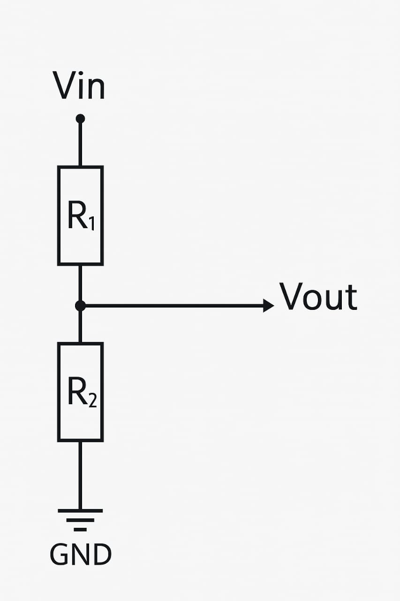

### Voltage Divider
A <b>voltage divider</b> is a simple circuit used to generate a specific output voltage (Vout) that is a fraction of the input voltage (Vin). It is commonly used in analog circuits for signal conditioning, reference voltages, and biasing active devices.

The voltage divider circuit consists of two resistors,  and , connected in series across a voltage source. The output voltage is taken from the junction of these two resistors.
The voltage divider is a simple circuit used to reduce voltage using two resistors in series. The output voltage is taken from the junction of the two resistors.

<b>Formula: </b>

The output voltage Vout of a voltage divider circuit is given by:

$$V_{\text{out}} = V_{\text{in}} \times \frac{R_2}{R_1 + R_2}$$

Similarly, the voltage across R1 can be calculated as:

$$V_{R_1} = V_{\text{in}} \times \frac{R_1}{R_1 + R_2}$$

where:
- Vout is the input voltage,
- R1 are the resistances in the divider network.

This formula is fundamental in electronics for scaling voltage levels efficiently.
              

This formula shows that by adjusting the values of R1 and R2, the output voltage Vout can be varied proportionally.

## Circuit diagram
<!--

-->

  

## Features of Simulation:

<li>Sliders to control Vin, R1, and R2 values.</li>

<li>Real-time Vout calculation and display.</li>

<li>Graphical representation using voltmeter and oscilloscope images.</li>

<li>Animated arrows to show current direction.</li>

<li>Component value table that updates live.</li>

<li>Responsive UI for web-based access via GitHub.</li>

### Applications:

<li>Used in analog electronics to scale down voltages.</li>

<li>Acts as a biasing element in transistor circuits.</li>

<li>Helps in signal conditioning and level shifting in embedded systems.</li>

<li>Sensor interfacing (to scale sensor output).</li>

<li> Volume control in audio circuits.</li>

